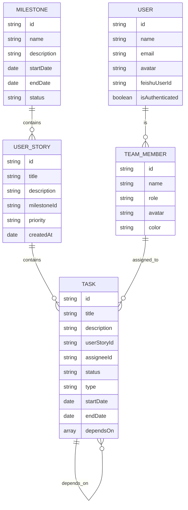

## 1. Architecture Design
```mermaid
graph TB
    A[React 前端] --&gt; B[Zustand 状态管理]
    B --&gt; C[本地存储 localStorage]
    A --&gt; D[React Router 路由]
    A --&gt; E[Tailwind CSS 样式]
    A --&gt; F[Lucide React 图标]
    A --&gt; G[飞书 SSO OAuth]
    G --&gt; H[权限控制层]
```

## 2. Technology Description
- Frontend: React 18 + TypeScript + tailwindcss 3 + vite
- Initialization Tool: vite-init
- Backend: 无（本地数据存储）
- Database: localStorage + Zustand
- Authentication: 飞书 OAuth 2.0 SSO
- Authorization: 基于登录状态的权限控制

## 3. Route Definitions
| Route | Purpose |
|-------|---------|
| / | 看板视图首页 |
| /stories | 用户故事管理 |
| /milestones | 里程碑视图 |
| /gantt | 甘特图视图 |
| /team | 团队成员管理 |
| /login | 登录页面（飞书 SSO 回调） |

## 4. Data Model

### 4.1 Data Model Definition


### 4.2 TypeScript Type Definitions
```typescript
interface User {
  id: string;
  name: string;
  email: string;
  avatar: string;
  feishuUserId: string;
  isAuthenticated: boolean;
}

interface TeamMember {
  id: string;
  name: string;
  role: 'uiux' | 'frontend' | 'backend' | 'test';
  avatar: string;
  color: string;
}

interface Milestone {
  id: string;
  name: string;
  description: string;
  startDate: string;
  endDate: string;
  status: 'planning' | 'in-progress' | 'completed';
}

interface UserStory {
  id: string;
  title: string;
  description: string;
  milestoneId: string;
  priority: 'low' | 'medium' | 'high';
  createdAt: string;
}

interface Task {
  id: string;
  title: string;
  description: string;
  userStoryId: string;
  assigneeId: string;
  status: 'todo' | 'in-progress' | 'review' | 'done';
  type: 'design' | 'dev' | 'test';
  startDate: string;
  endDate: string;
  dependsOn: string[];
}

interface AppState {
  user: User | null;
  teamMembers: TeamMember[];
  milestones: Milestone[];
  userStories: UserStory[];
  tasks: Task[];
  activeView: 'kanban' | 'stories' | 'milestones' | 'gantt' | 'team';
}
```

## 5. 状态管理设计
使用 Zustand 进行全局状态管理，包含：
- 用户认证状态
- 团队成员数据
- 里程碑数据
- 用户故事数据
- 任务数据
- 当前视图状态
- 数据持久化到 localStorage

## 6. 飞书 SSO 集成
### 6.1 OAuth 流程
1. 用户点击「飞书登录」
2. 重定向到飞书授权页面
3. 用户授权后回调到应用
4. 应用获取授权码并换取 access_token
5. 使用 access_token 获取用户信息
6. 存储用户信息到状态和 localStorage

### 6.2 配置
- APP_ID: 飞书应用 ID
- APP_SECRET: 飞书应用密钥（需要后端代理）
- REDIRECT_URI: 回调地址

## 7. 权限控制
### 7.1 权限规则
- **访客**：所有编辑功能禁用，按钮灰化显示「登录后编辑」
- **登录用户**：所有功能正常可用

### 7.2 权限检查 Hook
```typescript
const useAuth = () =&gt; {
  const { user } = useStore();
  const isAuthenticated = user?.isAuthenticated ?? false;
  return { isAuthenticated, user };
};
```

## 8. 核心组件结构
```
src/
├── components/
│   ├── Navigation.tsx
│   ├── TaskCard.tsx
│   ├── AuthButton.tsx (新增)
│   └── RequireAuth.tsx (新增)
├── pages/
│   ├── KanbanPage.tsx
│   ├── StoriesPage.tsx
│   ├── MilestonesPage.tsx
│   ├── GanttPage.tsx
│   ├── TeamPage.tsx
│   └── LoginPage.tsx (新增)
├── store/
│   └── useStore.ts
├── types/
│   └── index.ts
├── utils/
│   ├── dateUtils.ts
│   └── feishuAuth.ts (新增)
├── hooks/
│   └── useAuth.ts (新增)
```
